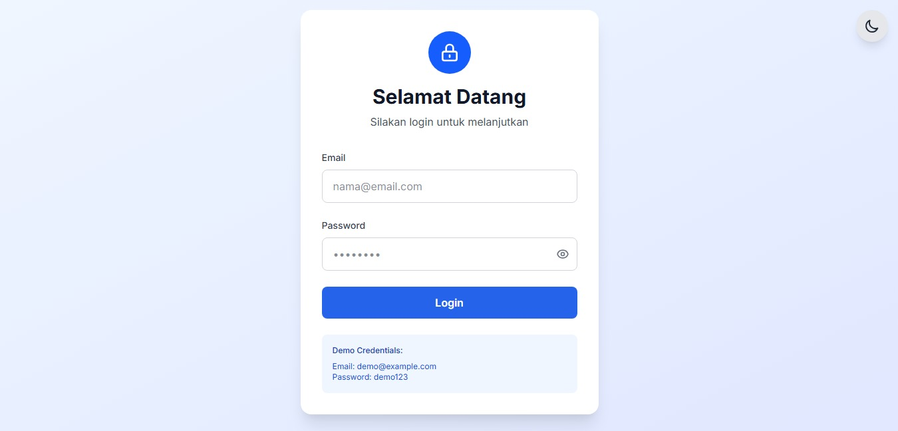
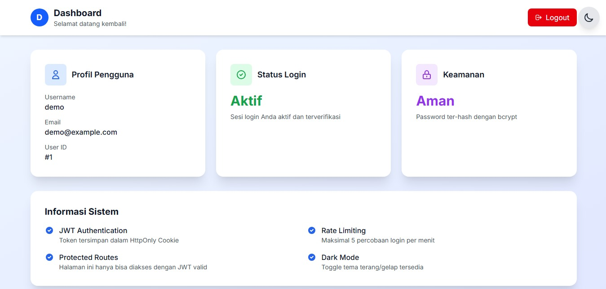
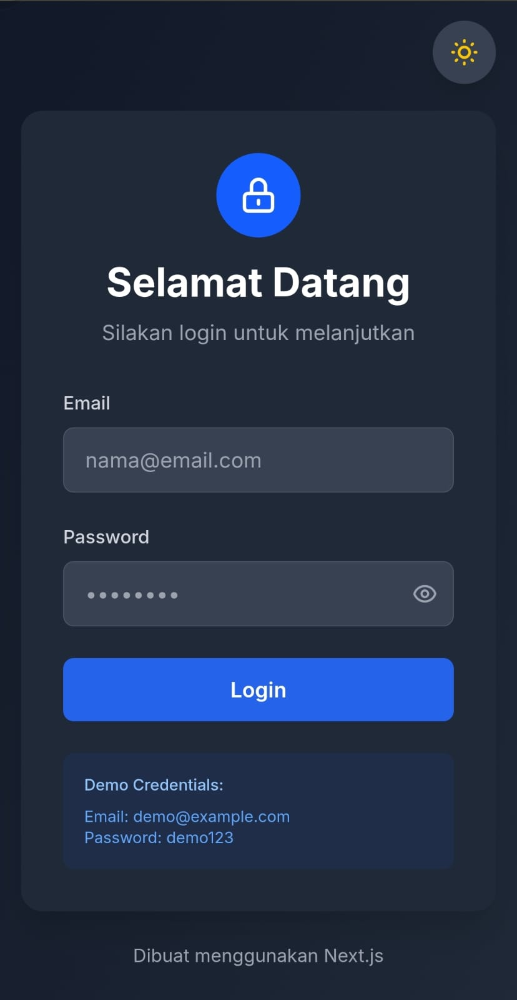
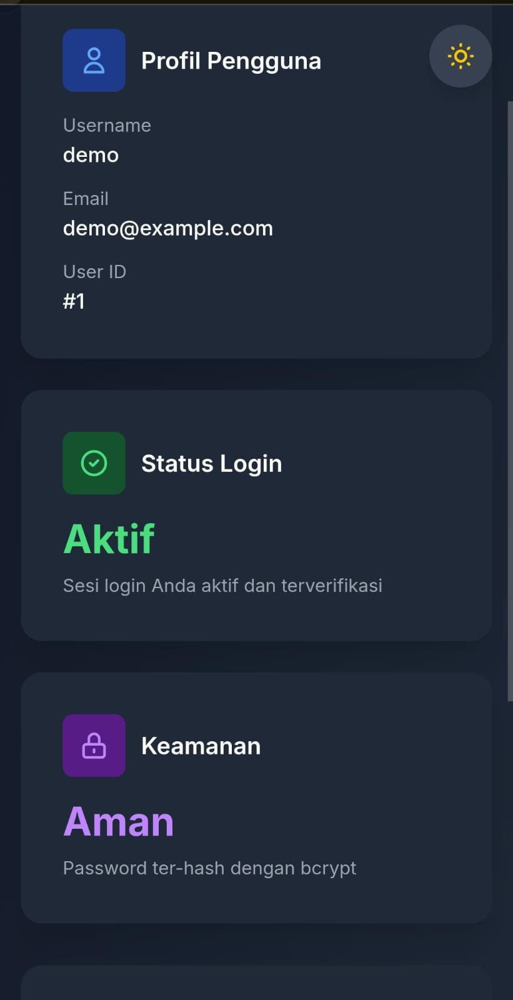
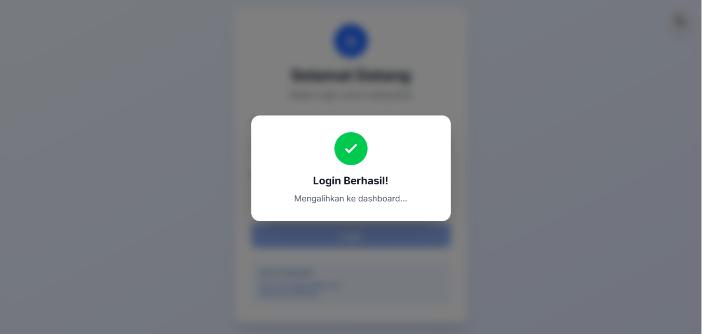
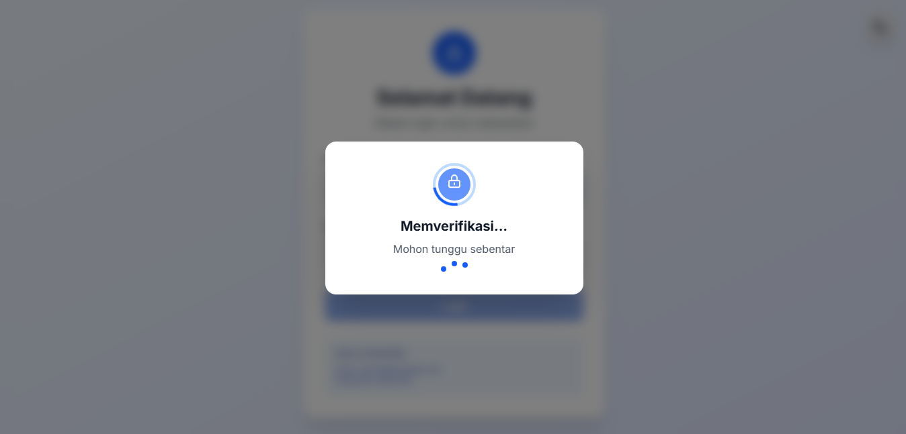

# Login App

# Screenshot

# Run Project

- Node.js 18+
- npm

# Installation

1. Clone repository

- git clone https://github.com/tofuqwerty/dashboard-demo.git
- cd dashboard-demo

2. Install dependencies

- npm install

3. Env Local

- copy .env.example to .env.local

** edit .env.local with your MySQL

4. Setup Database

- node scripts/seed.js

5. Run Development

- npm run dev
- open http://localhost:3000

6. Login 

- Email: demo@example.com
- Password: demo123

# Tech Stack

- Next.js
- TypeScript
- Tailwind CSS
- MySQL
- JWT
- dotenv
- Vercel
- Aiven 

# Demo

https://dashboard-demo-testing.vercel.app/
